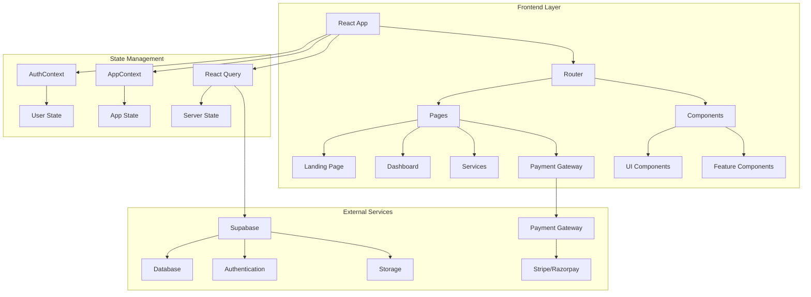
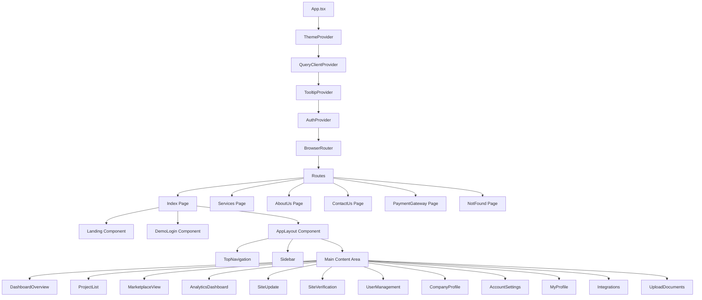
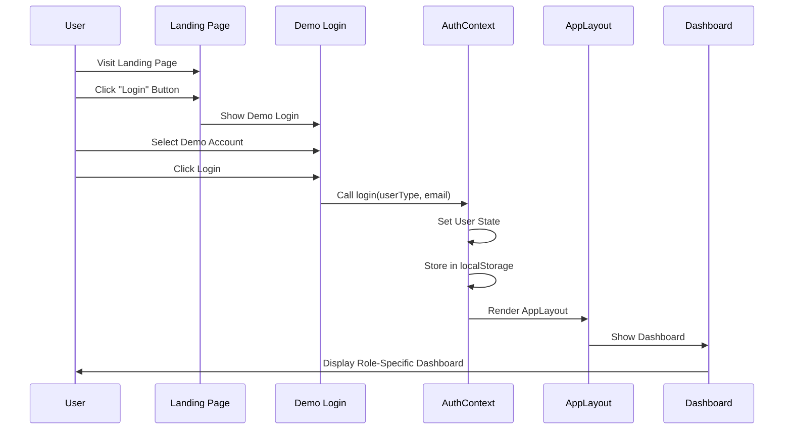
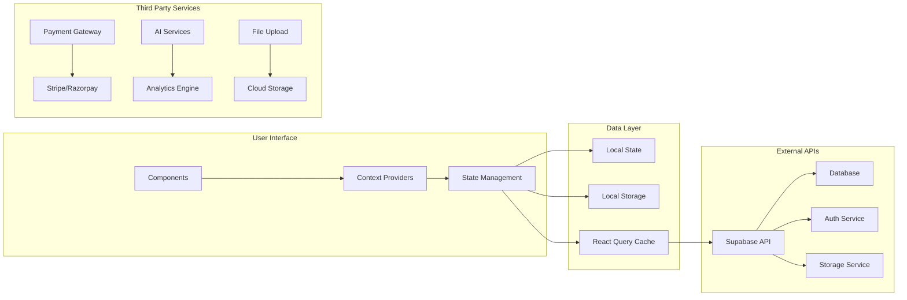
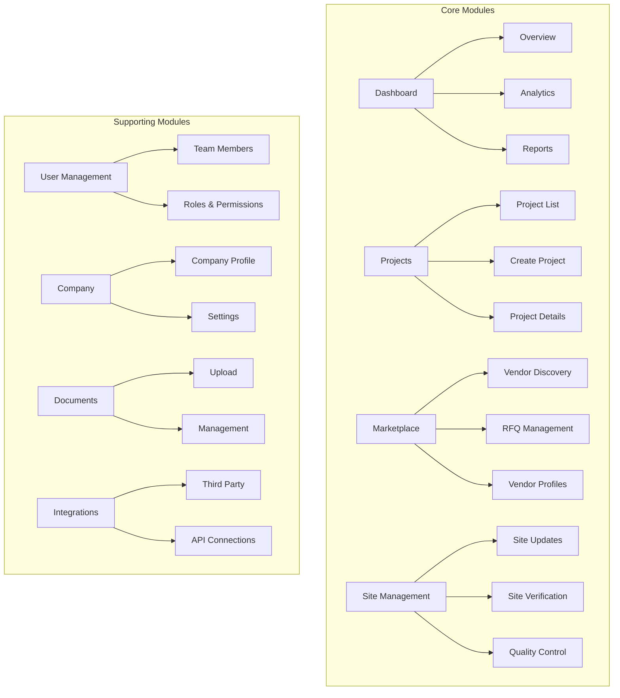
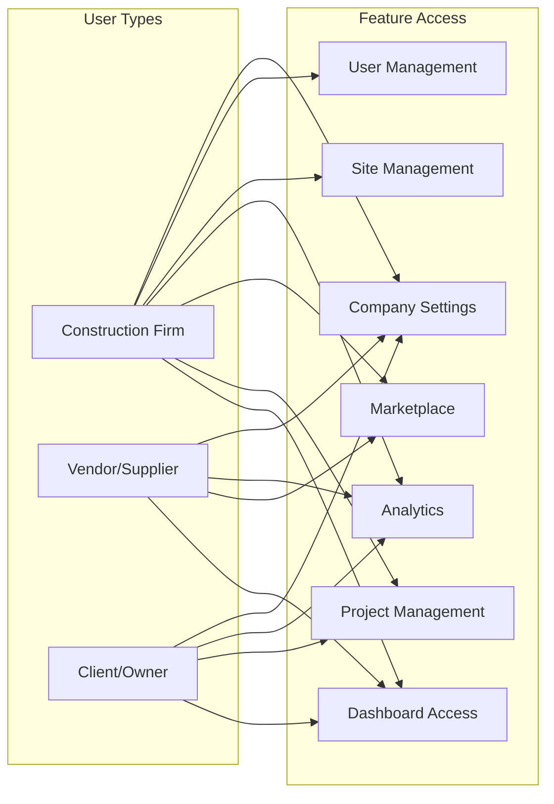
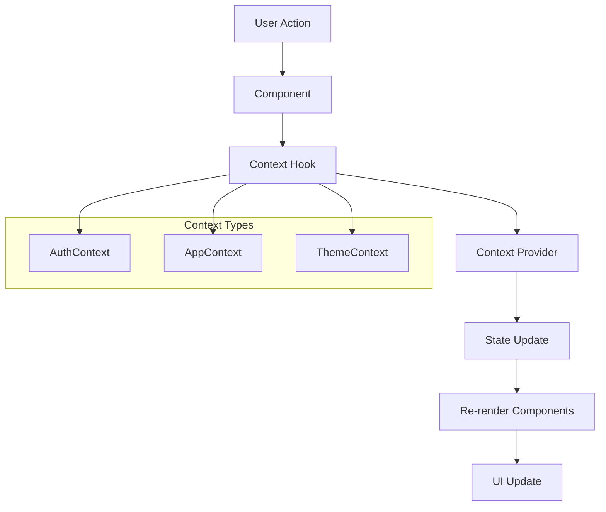
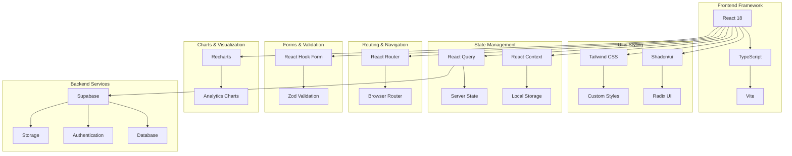
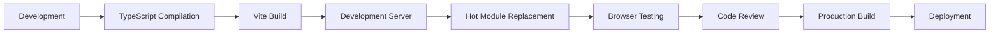

# BuildBridge AI - System Architecture Documentation

## 1. High-Level System Architecture



## 2. Component Hierarchy



## 3. User Authentication Flow



## 4. Data Flow Architecture



## 5. Feature Module Architecture



## 6. User Role Permissions Matrix



## 7. State Management Flow



## 8. File Structure Overview

```
src/
├── components/
│   ├── ui/           # Reusable UI components
│   ├── auth/         # Authentication components
│   ├── dashboard/    # Dashboard components
│   ├── projects/     # Project management
│   ├── marketplace/  # Vendor marketplace
│   ├── analytics/    # Analytics and reports
│   ├── site/         # Site management
│   ├── users/        # User management
│   ├── company/      # Company settings
│   ├── documents/    # Document management
│   ├── integrations/ # Third-party integrations
│   ├── profile/      # User profile
│   ├── settings/     # Account settings
│   └── layout/       # Layout components
├── pages/            # Main page components
├── contexts/         # React contexts
├── hooks/            # Custom hooks
├── lib/              # Utility functions
└── main.tsx          # App entry point
```

## 9. Technology Stack Diagram



## 10. Development Workflow

