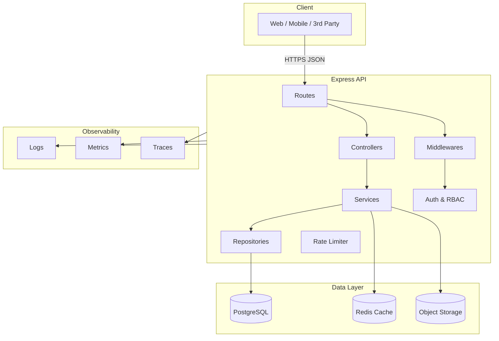

# Backend Architecture (Express)

### High-Level Diagram

### Layers
- **Routes**: Map HTTP paths to controllers, apply per-route middlewares (auth, validation).
- **Controllers**: Translate HTTP to service calls; no business logic.
- **Services**: Business rules, transactions, orchestration.
- **Repositories**: Data access to Postgres/Redis/External APIs.
- **Middlewares**: Cross-cutting concerns (auth, input validation, rate-limiting, request-id, error mapping).

### Cross-Cutting Concerns
- **Configuration**: Central config loader with schema validation (e.g., Zod) and typed access.
- **Logging**: Structured JSON logs with request correlation id.
- **Errors**: Central error shape `{ code, message, details, correlationId }` and mapping table.
- **Validation**: Request schemas for params/query/body; reject on first error with 400 + details.
- **Security**: See `security.md`.
- **Observability**: HTTP metrics, DB latency histograms, error rate, p95/p99 latency.

### Health & Readiness
- `GET /health`: Liveness probe (process up).
- `GET /ready`: Readiness probe (DB ping + critical dependencies).

### Graceful Shutdown
- Trap SIGTERM/SIGINT, stop accepting connections, drain in-flight requests, close DB/Redis.

### Versioning
- Prefix with `/v1`. Future versions `/v2` can run in parallel behind the gateway.

### Idempotency
- For write-critical endpoints (e.g., document upload, payment hooks), support `Idempotency-Key` header with Redis-backed keys expiring after 24h.

### Rate Limiting
- Token-bucket per API key/user and per IP fallbacks. Burst and sustained limits documented in `security.md`.
