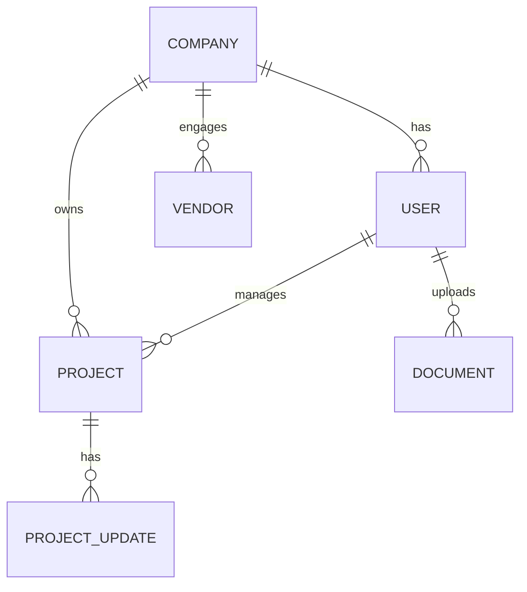

# Database

### Engine
- PostgreSQL 13+ recommended. Connection pooling via pgBouncer or Prisma pool.

### Core Entities
- Users: accounts, roles, status
- Companies: organization for users
- Projects: owned by company, have updates
- Vendors: vendor profiles and services
- Documents: uploaded files metadata
- ProjectUpdates: status/progress notes

### ER Diagram (Conceptual)

### Indexing & Constraints
- Primary keys are UUIDv4.
- Unique: `users.email`, `vendors.slug`.
- Foreign keys with `ON DELETE RESTRICT` or `CASCADE` as appropriate.
- Partial indexes for active records when beneficial.

### Migrations
- Use Prisma Migrate or Knex migrations.
- Never edit past migrations; create a new one for each change.
- See `migrations.md` for process and rollback strategy.

### Performance
- Use transactions for multi-step writes.
- Keep queries in repositories; avoid N+1 via joins or batching.
- Monitor slow queries; add indexes based on real workload.
