# BuildBridge AI - Business Model Canvas

## 1. Business Model Overview

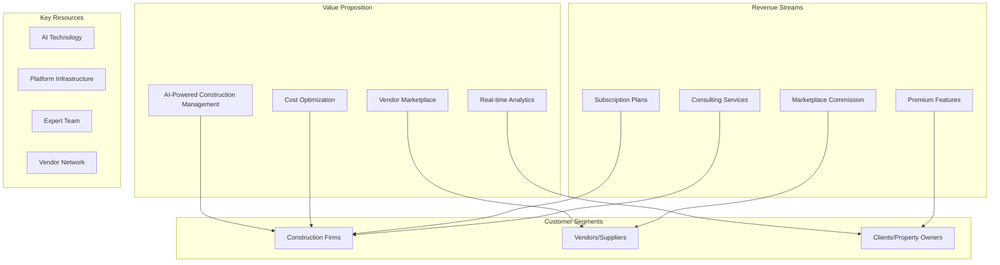

## 2. Value Proposition Canvas

### 2.1 Customer Jobs

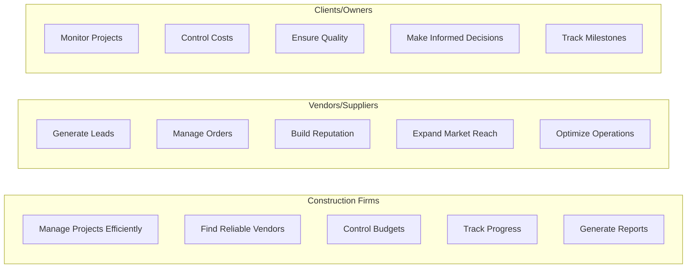

### 2.2 Customer Pains

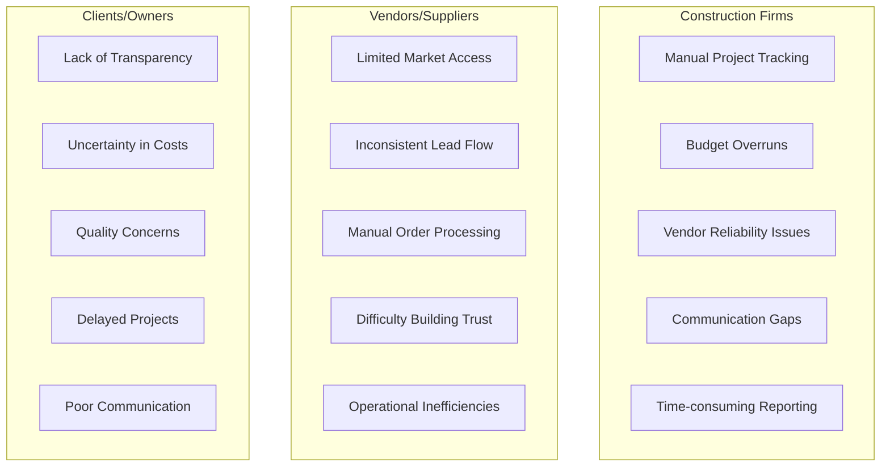

### 2.3 Customer Gains

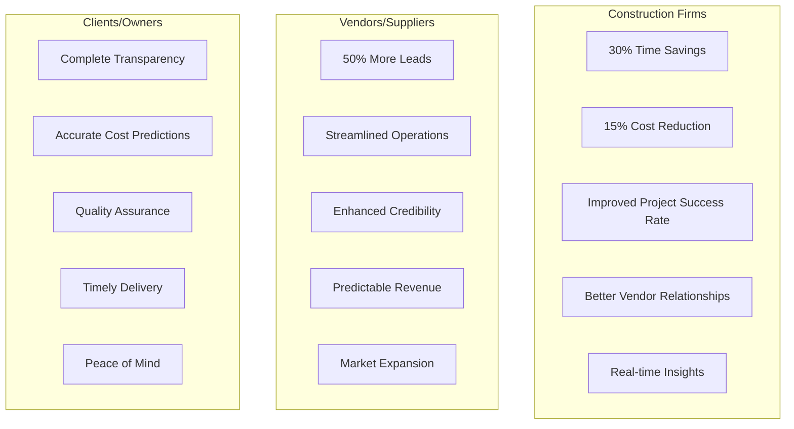

## 3. Revenue Model

### 3.1 Subscription Tiers

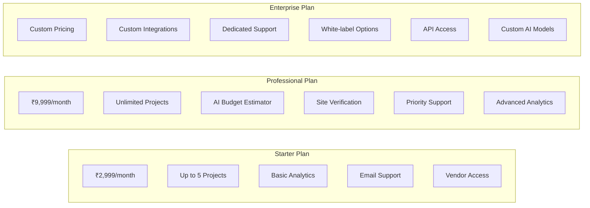

### 3.2 Revenue Streams Breakdown

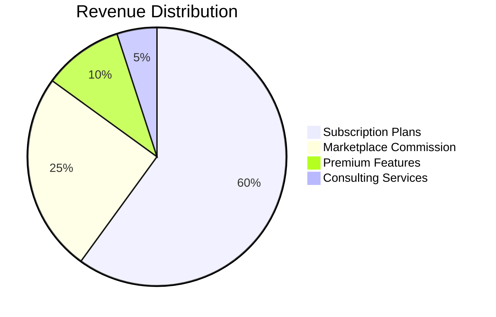

## 4. Cost Structure

### 4.1 Fixed Costs

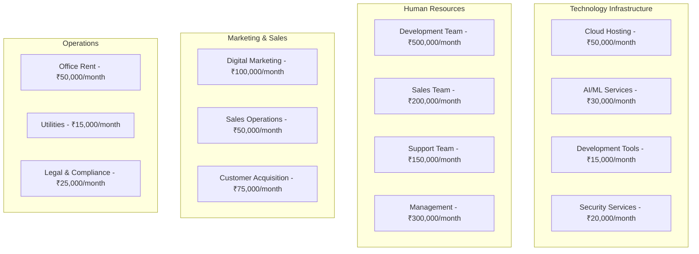

### 4.2 Variable Costs

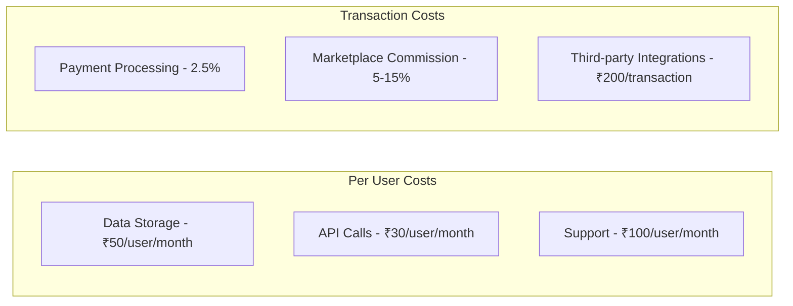

## 5. Key Partnerships

### 5.1 Strategic Partners

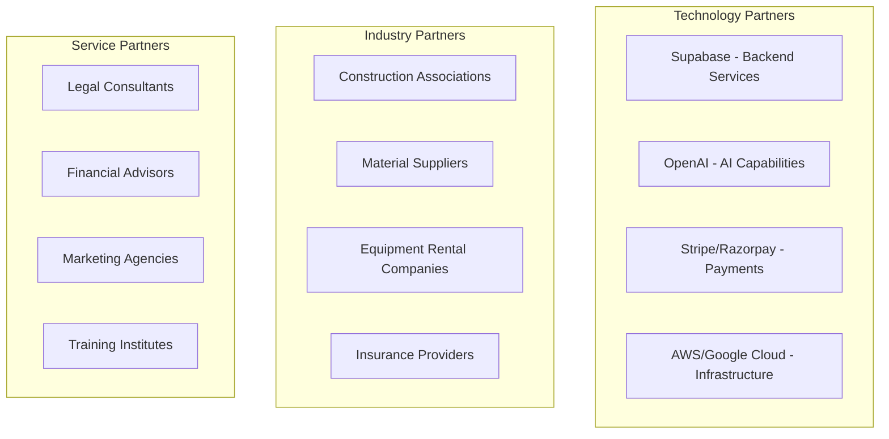

### 5.2 Partnership Benefits

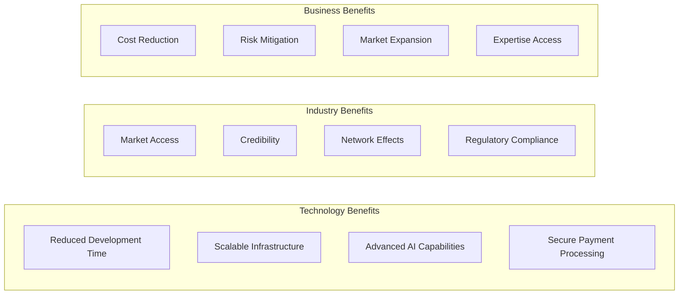

## 6. Key Activities

### 6.1 Core Activities

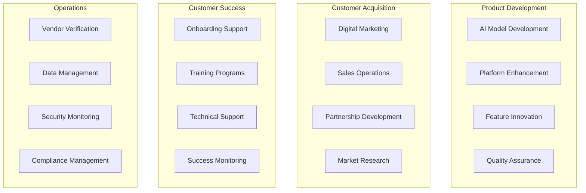

## 7. Key Resources

### 7.1 Physical Resources

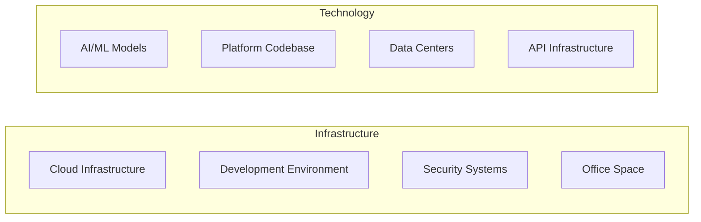

### 7.2 Human Resources

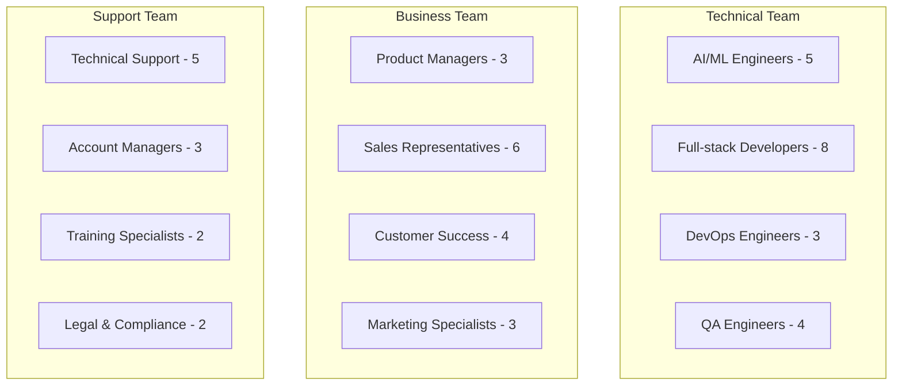

### 7.3 Intellectual Resources

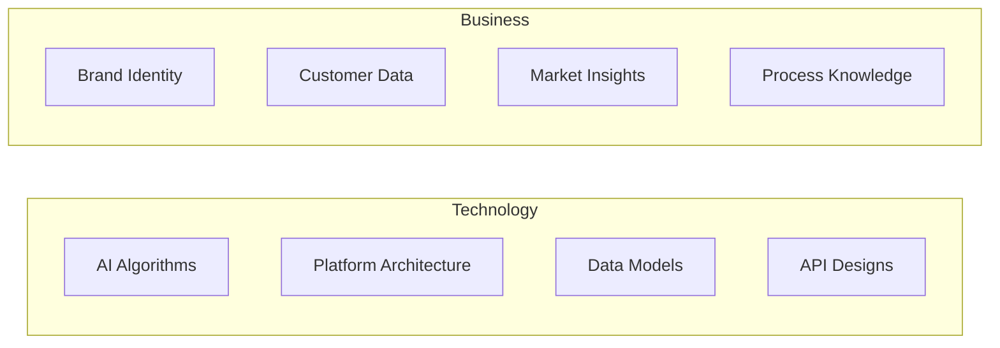

## 8. Customer Relationships

### 8.1 Relationship Types

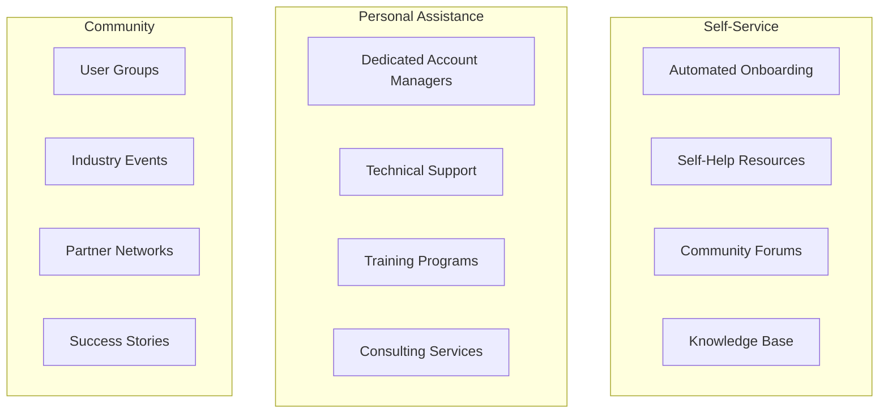

## 9. Channels

### 9.1 Distribution Channels

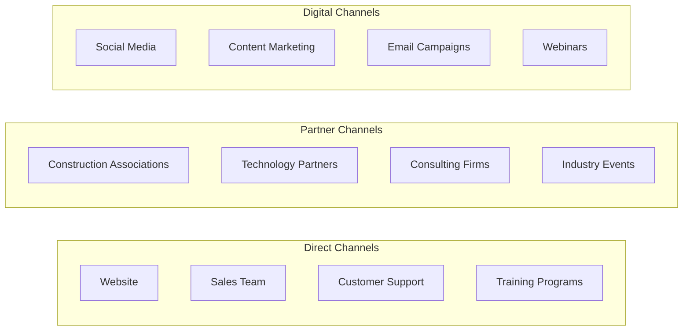

## 10. Financial Projections

### 10.1 Revenue Projections (3 Years)

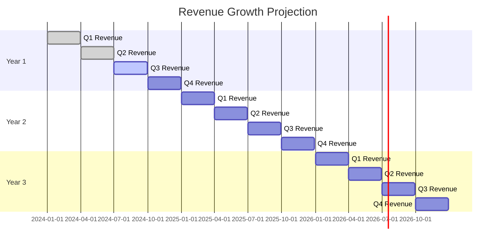

### 10.2 Key Metrics

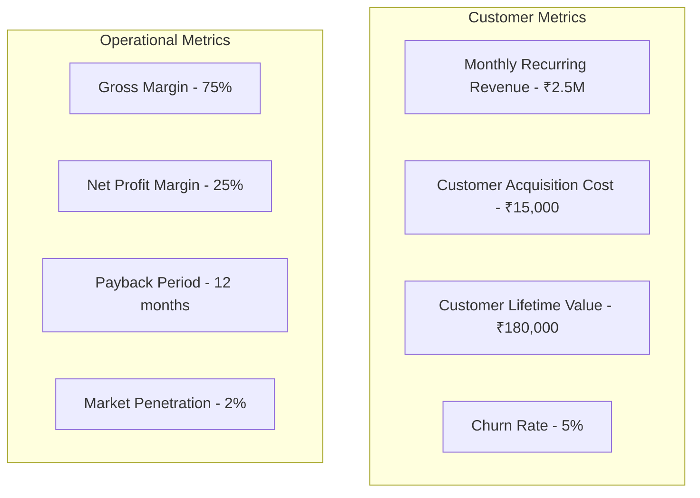

## 11. Competitive Advantage

### 11.1 Unique Value Propositions

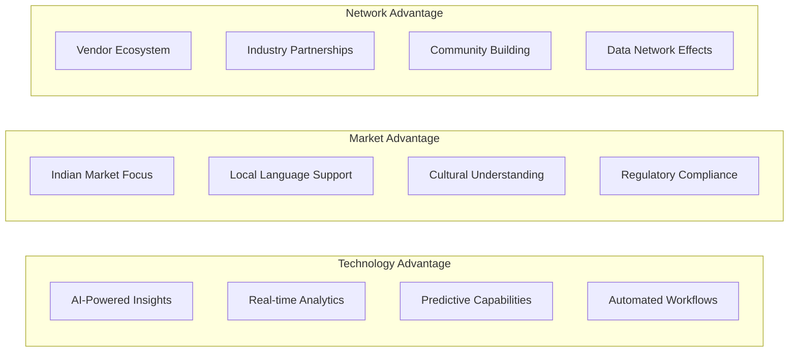

## 12. Risk Analysis

### 12.1 Business Risks

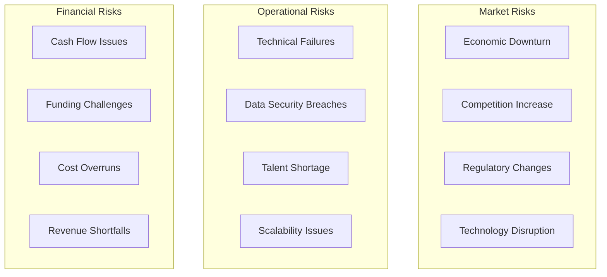

### 12.2 Risk Mitigation Strategies

```mermaid
graph LR
    subgraph "Technology"
        A[Redundant Infrastructure]
        B[Security Protocols]
        C[Regular Backups]
        D[Disaster Recovery]
    end
    
    subgraph "Business"
        E[Diversified Revenue]
        F[Strong Partnerships]
        G[Insurance Coverage]
        H[Compliance Framework]
    end
    
    subgraph "Financial"
        I[Cash Reserves]
        J[Multiple Funding Sources]
        K[Cost Controls]
        L[Revenue Diversification]
    end
``` 