# BuildBridge AI - Technical Architecture Documentation

## 1. System Architecture Overview

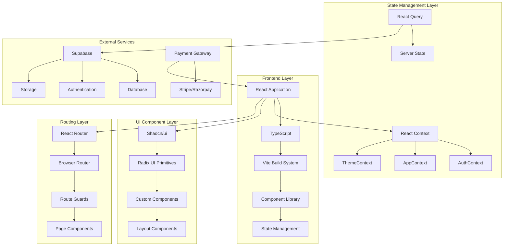

## 2. Component Architecture

### 2.1 Component Hierarchy

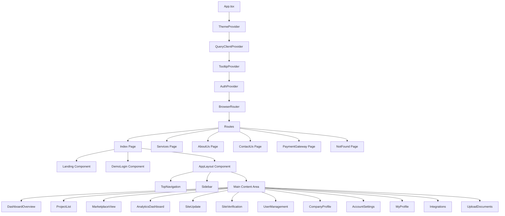

### 2.2 Component Categories

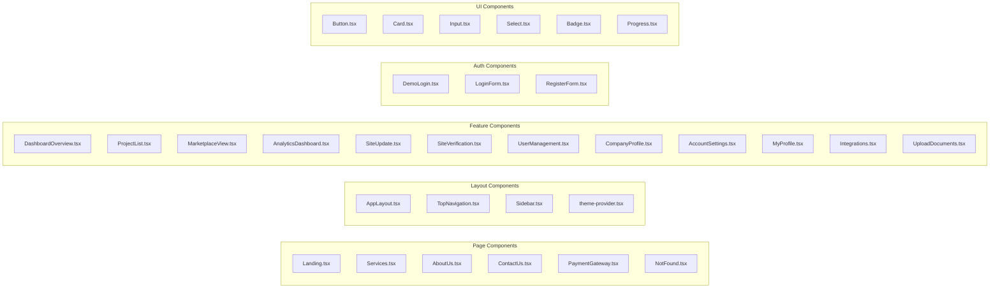

## 3. State Management Architecture

### 3.1 Context Structure

```mermaid
graph TB
    subgraph "AuthContext"
        A[user: User | null]
        B[isAuthenticated: boolean]
        C[login: function]
        D[logout: function]
    end
    
    subgraph "AppContext"
        E[sidebarOpen: boolean]
        F[projects: Project[]]
        G[users: User[]]
        H[documents: Document[]]
        I[toggleSidebar: function]
        J[addProject: function]
        K[addUser: function]
        L[updateUser: function]
        M[addDocument: function]
    end
    
    subgraph "ThemeContext"
        N[theme: string]
        O[setTheme: function]
    end
    
    subgraph "React Query"
        P[serverState: any]
        Q[mutations: any]
        R[cache: any]
    end
```

### 3.2 Data Flow

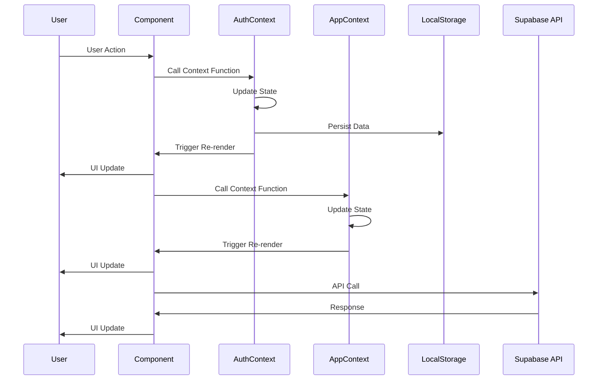

## 4. Data Models

### 4.1 User Model

```typescript
interface User {
  id: string;
  email: string;
  userType: 'construction-firm' | 'vendor' | 'client';
  name: string;
  company?: string;
  role: string;
  status: 'active' | 'inactive';
  lastLogin: string;
  projects: string[];
}
```

### 4.2 Project Model

```typescript
interface Project {
  id: string;
  name: string;
  type: string;
  location: string;
  startDate: string;
  endDate: string;
  budget: number;
  status: 'In Progress' | 'On Track' | 'Delayed' | 'Completed';
  progress: number;
  createdAt: string;
  manager: string;
  teamMembers: string[];
}
```

### 4.3 Document Model

```typescript
interface Document {
  id: string;
  name: string;
  type: string;
  size: number;
  uploadDate: string;
  projectId?: string;
  uploadedBy: string;
  url: string;
}
```

### 4.4 Vendor Model

```typescript
interface Vendor {
  id: string;
  name: string;
  type: 'Material Supplier' | 'Construction' | 'Equipment';
  region: string;
  rating: number;
  reviews: number;
  services: string[];
  contact: string;
  email: string;
  verified: boolean;
  description: string;
}
```

## 5. File Structure Analysis

### 5.1 Directory Structure

```mermaid
graph TD
    A[src/] --> B[components/]
    A --> C[pages/]
    A --> D[contexts/]
    A --> E[hooks/]
    A --> F[lib/]
    A --> G[main.tsx]
    A --> H[App.tsx]
    
    B --> I[ui/]
    B --> J[auth/]
    B --> K[dashboard/]
    B --> L[projects/]
    B --> M[marketplace/]
    B --> N[analytics/]
    B --> O[site/]
    B --> P[users/]
    B --> Q[company/]
    B --> R[documents/]
    B --> S[integrations/]
    B --> T[profile/]
    B --> U[settings/]
    B --> V[layout/]
    
    C --> W[Index.tsx]
    C --> X[Landing.tsx]
    C --> Y[Services.tsx]
    C --> Z[AboutUs.tsx]
    C --> AA[ContactUs.tsx]
    C --> BB[PaymentGateway.tsx]
    C --> CC[NotFound.tsx]
    
    D --> DD[AuthContext.tsx]
    D --> EE[AppContext.tsx]
    
    E --> FF[use-mobile.ts]
    E --> GG[use-toast.ts]
```

### 5.2 Component Organization

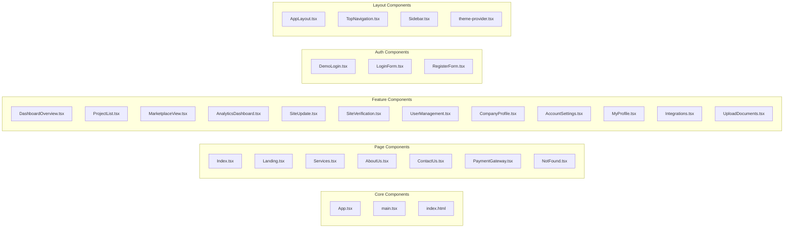

## 6. Routing Architecture

### 6.1 Route Structure

```mermaid
graph TD
    A[BrowserRouter] --> B[Routes]
    B --> C[Route: "/"]
    B --> D[Route: "/services"]
    B --> E[Route: "/about"]
    B --> F[Route: "/contact"]
    B --> G[Route: "/payment"]
    B --> H[Route: "*"]
    
    C --> I[Index Component]
    I --> J[Landing Component]
    I --> K[DemoLogin Component]
    I --> L[AppLayout Component]
    
    L --> M[TopNavigation]
    L --> N[Sidebar]
    L --> O[Main Content]
    
    O --> P[/dashboard]
    O --> Q[/projects]
    O --> R[/create-project]
    O --> S[/marketplace]
    O --> T[/analytics]
    O --> U[/site-update]
    O --> V[/site-verification]
    O --> W[/user-management]
    O --> X[/company-profile]
    O --> Y[/account-settings]
    O --> Z[/my-profile]
    O --> AA[/integrations]
    O --> BB[/upload-documents]
```

### 6.2 Navigation Flow

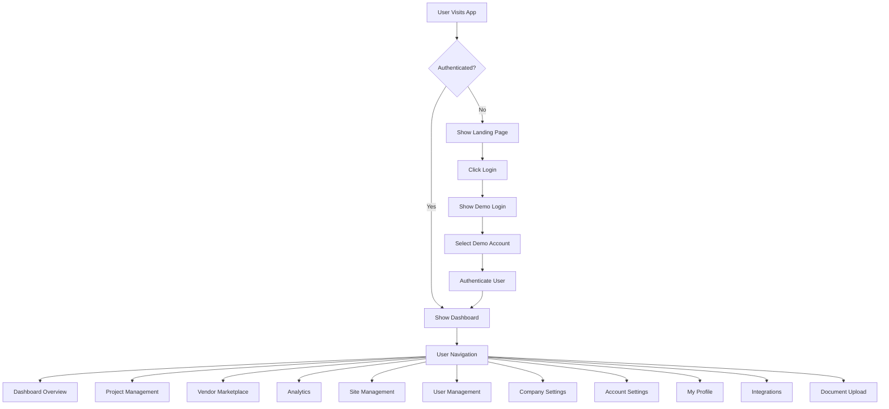

## 7. Authentication Flow

### 7.1 Authentication Process

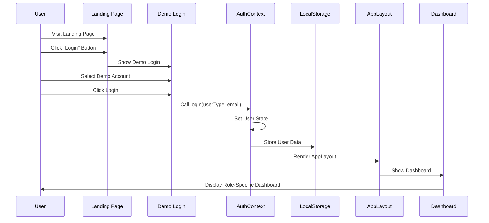

### 7.2 Session Management

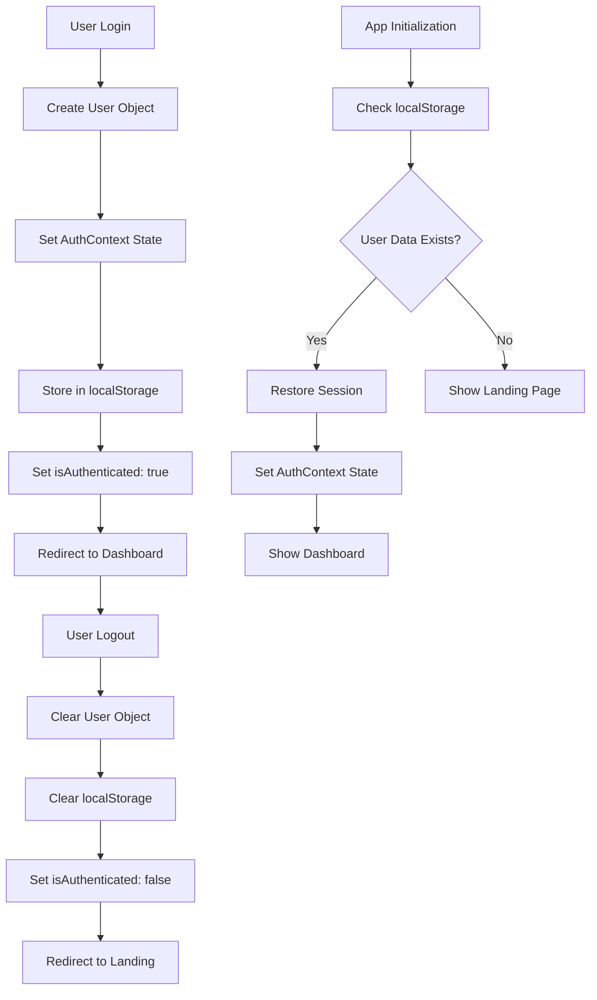

## 8. Component Communication

### 8.1 Props Flow

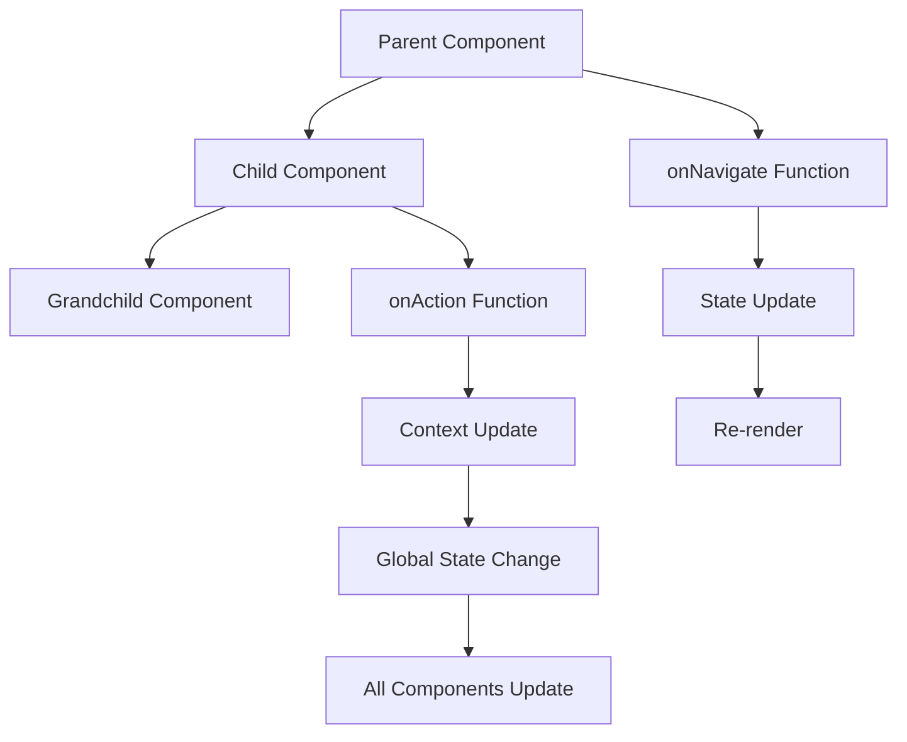

### 8.2 Context Usage

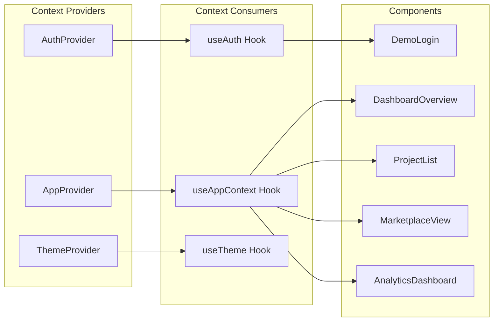

## 9. Performance Optimization

### 9.1 Code Splitting

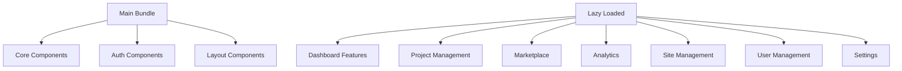

### 9.2 State Optimization

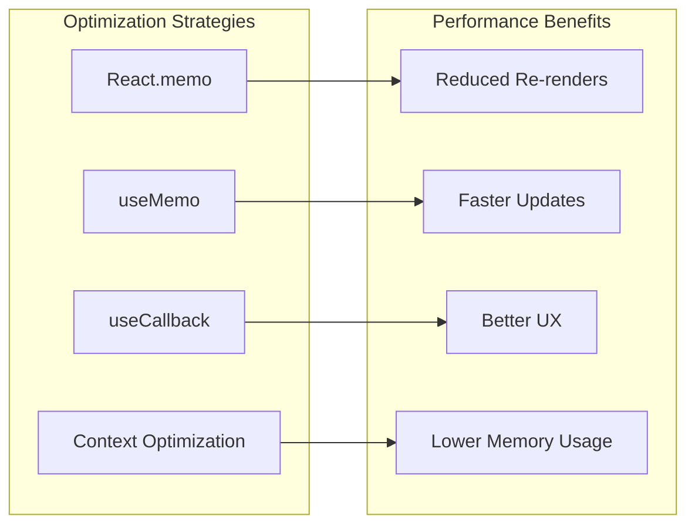

## 10. Error Handling

### 10.1 Error Boundaries

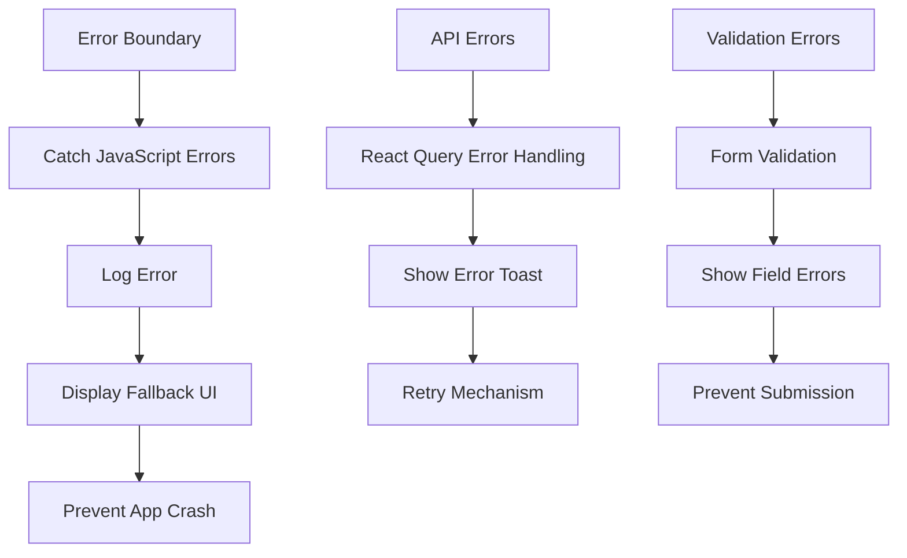

### 10.2 Error Types

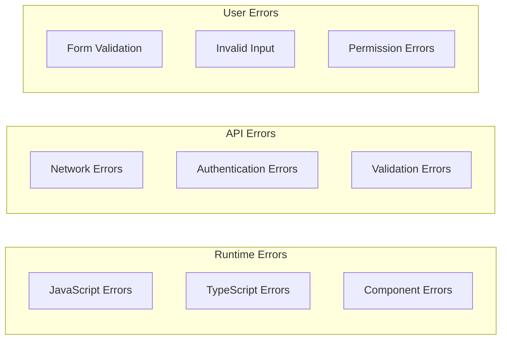

## 11. Security Considerations

### 11.1 Security Measures

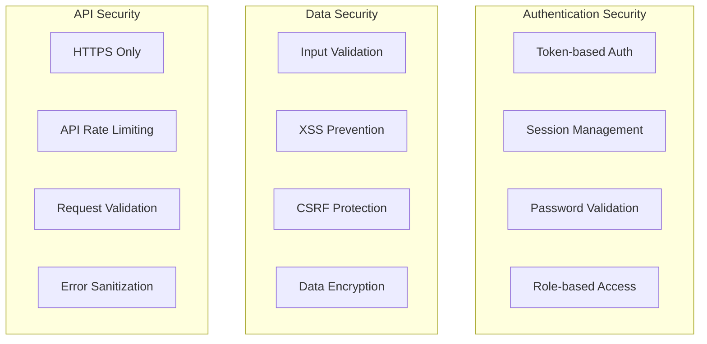

## 12. Testing Strategy

### 12.1 Testing Pyramid

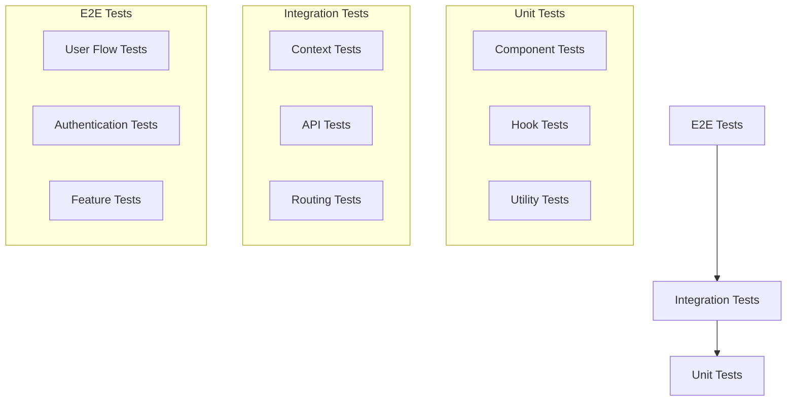

### 12.2 Test Coverage

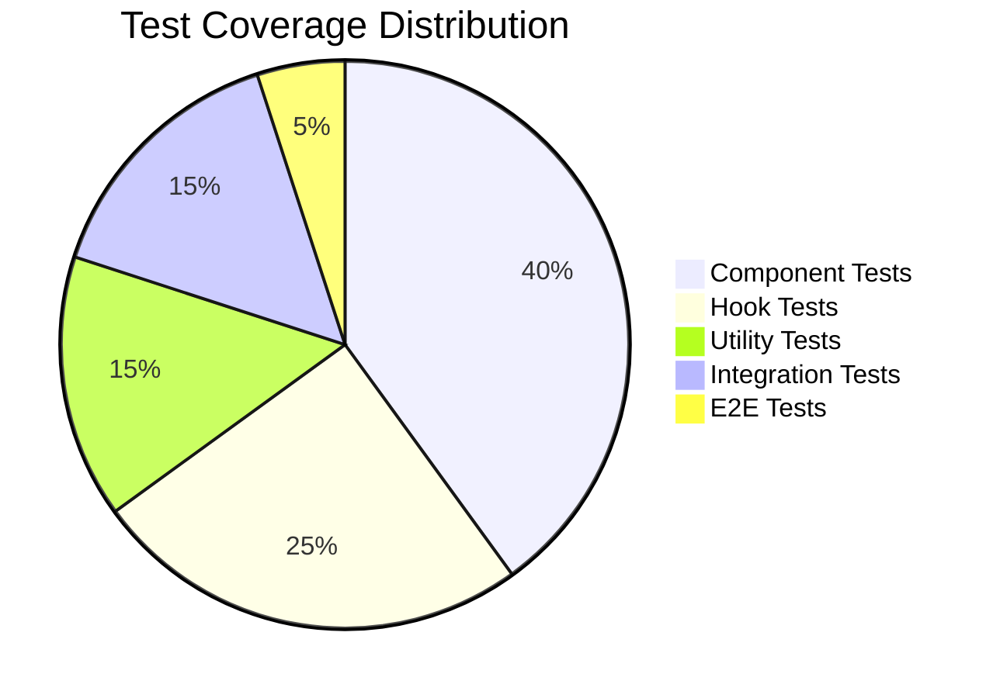

## 13. Deployment Architecture

### 13.1 Build Process

```mermaid
graph LR
    A[Source Code] --> B[TypeScript Compilation]
    B --> C[Vite Build]
    C --> D[Bundle Optimization]
    D --> E[Static Assets]
    E --> F[Deployment]
    
    subgraph "Build Steps"
        G[Lint Code]
        H[Type Check]
        I[Bundle Analysis]
        J[Optimize Assets]
    end
```

### 13.2 Deployment Pipeline

```mermaid
graph TD
    A[Code Commit] --> B[GitHub Actions]
    B --> C[Run Tests]
    C --> D[Build Application]
    D --> E[Deploy to Staging]
    E --> F[Manual Testing]
    F --> G[Deploy to Production]
    G --> H[Monitor Performance]
```

## 14. Monitoring and Analytics

### 14.1 Performance Monitoring

```mermaid
graph LR
    subgraph "Frontend Monitoring"
        A[Bundle Size]
        B[Load Time]
        C[Render Performance]
        D[User Interactions]
    end
    
    subgraph "Error Monitoring"
        E[JavaScript Errors]
        F[API Errors]
        G[User Feedback]
        H[Performance Issues]
    end
    
    subgraph "User Analytics"
        I[Page Views]
        J[User Flow]
        K[Feature Usage]
        L[Conversion Rates]
    end
```

## 15. Future Architecture Considerations

### 15.1 Scalability Plans

```mermaid
graph TB
    subgraph "Short Term"
        A[Code Splitting]
        B[Lazy Loading]
        C[Performance Optimization]
        D[Error Handling]
    end
    
    subgraph "Medium Term"
        E[Micro-frontends]
        F[Service Workers]
        G[Progressive Web App]
        H[Advanced Caching]
    end
    
    subgraph "Long Term"
        I[AI Integration]
        J[Real-time Features]
        K[Mobile App]
        L[API Gateway]
    end
```

### 15.2 Technology Evolution

```mermaid
graph LR
    subgraph "Current Stack"
        A[React 18]
        B[TypeScript]
        C[Vite]
        D[Shadcn/ui]
    end
    
    subgraph "Future Considerations"
        E[React 19]
        F[Server Components]
        G[Streaming SSR]
        H[Advanced AI]
    end
``` 