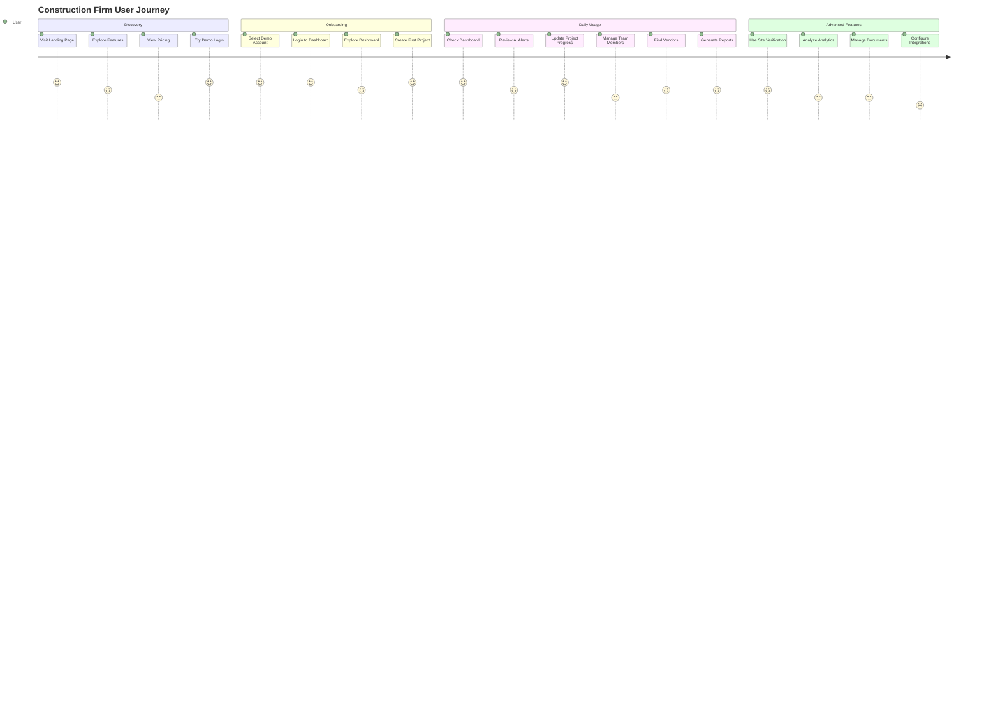
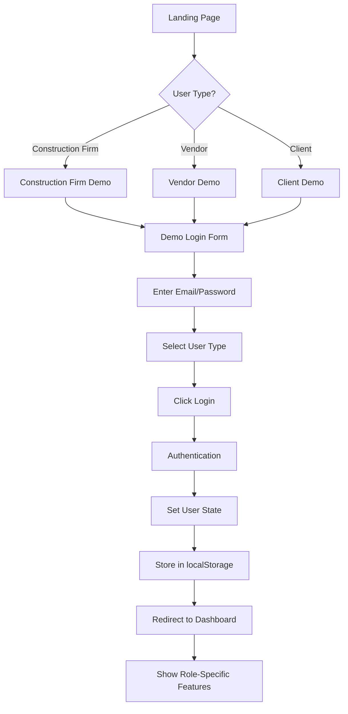
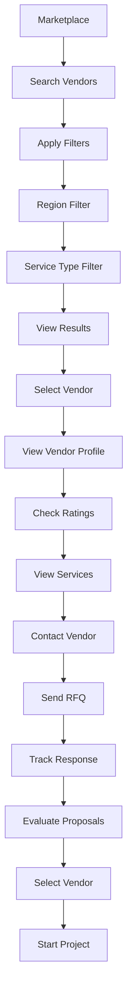
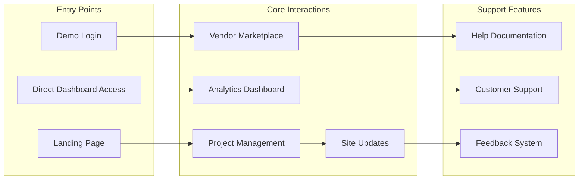
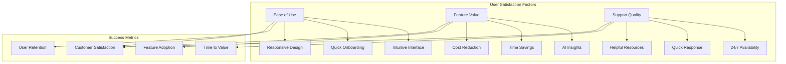
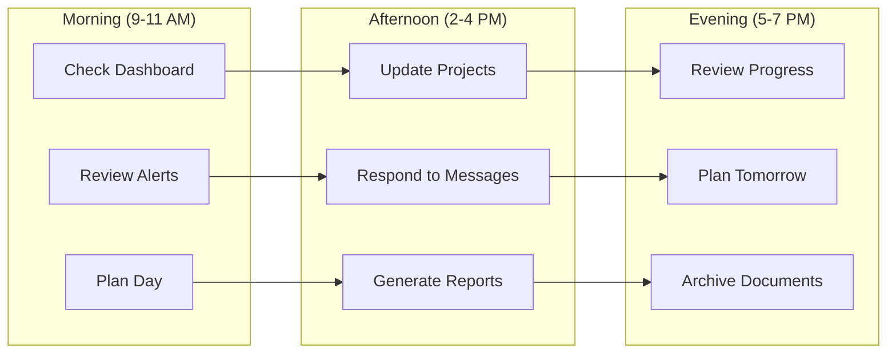
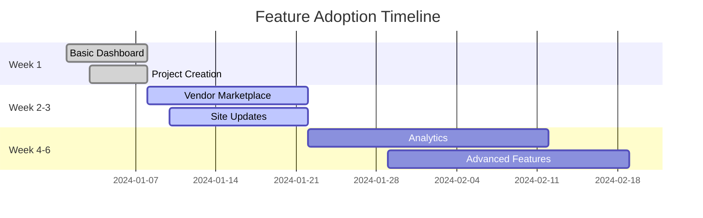
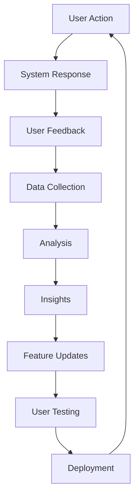
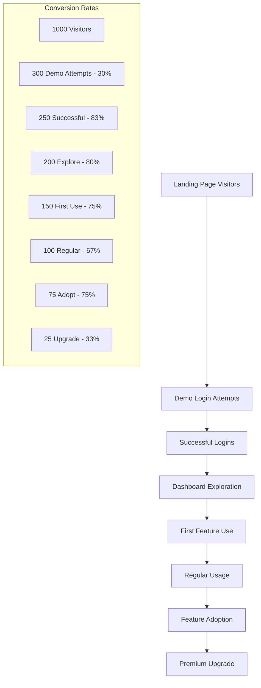
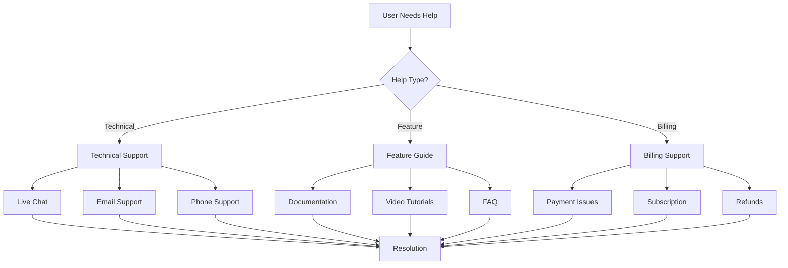

# BuildBridge AI - User Journey Maps

## 1. Construction Firm User Journey



## 2. Vendor/Supplier User Journey


## 3. Client/Owner User Journey


## 4. User Flow Diagrams

### 4.1 New User Registration Flow



### 4.2 Project Creation Flow

```mermaid
flowchart TD
    A[Dashboard] --> B[Click "New Project"]
    B --> C[Project Creation Form]
    C --> D[Enter Project Details]
    D --> E[Project Name]
    E --> F[Project Type]
    F --> G[Location]
    G --> H[Start Date]
    H --> I[End Date]
    I --> J[Budget]
    J --> K[Team Members]
    K --> L[Submit Form]
    L --> M[Create Project]
    M --> N[Show Success Message]
    N --> O[Redirect to Project List]
    O --> P[Project Appears in List]
```

### 4.3 Vendor Discovery Flow



## 5. User Experience Touchpoints

### 5.1 Key Interaction Points



### 5.2 User Satisfaction Metrics



## 6. User Personas

### 6.1 Construction Firm Manager

**Profile:**
- **Name:** Rajesh Kumar
- **Role:** Project Manager
- **Company:** ABC Construction Ltd.
- **Experience:** 8+ years in construction
- **Goals:** Streamline project management, reduce costs, improve efficiency

**Pain Points:**
- Manual project tracking
- Difficulty finding reliable vendors
- Budget overruns
- Communication gaps

**Platform Usage:**
- Daily dashboard monitoring
- Project creation and management
- Vendor discovery and selection
- Analytics and reporting

### 6.2 Vendor/Supplier Owner

**Profile:**
- **Name:** Sarah Johnson
- **Role:** Owner
- **Company:** Premium Supplies Co.
- **Experience:** 12+ years in supply chain
- **Goals:** Increase sales, expand client base, improve efficiency

**Pain Points:**
- Limited market reach
- Manual lead generation
- Difficulty in client communication
- Inconsistent order flow

**Platform Usage:**
- Marketplace profile management
- Lead monitoring and response
- Client communication
- Performance analytics

### 6.3 Client/Property Owner

**Profile:**
- **Name:** Mike Wilson
- **Role:** Property Developer
- **Company:** Wilson Properties
- **Experience:** 15+ years in real estate
- **Goals:** Quality construction, budget control, timely delivery

**Pain Points:**
- Lack of transparency
- Difficulty tracking progress
- Budget uncertainties
- Quality concerns

**Platform Usage:**
- Project monitoring
- Budget tracking
- Builder selection
- Progress verification

## 7. User Behavior Patterns

### 7.1 Daily Usage Patterns



### 7.2 Feature Adoption Timeline



## 8. User Feedback Loop



## 9. User Onboarding Funnel



## 10. User Support Journey

